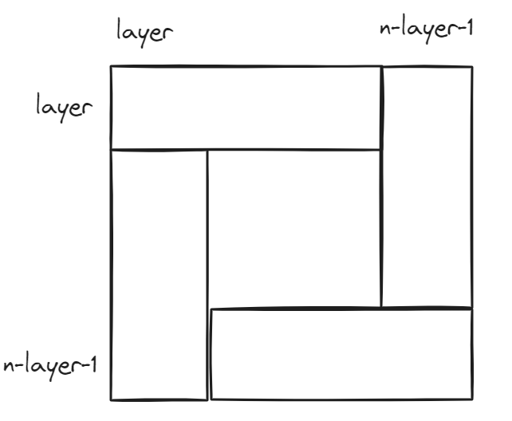

% _day2

# Day2: 数组理论基础-2

## LC977-有序数组平方-S:
- 给你一个按 **非递减顺序** 排序的整数数组 nums，返回 **每个数字的平方** 组成的新数组，要求也按 **非递减顺序** 排序。
- 思路：最大平方数在两端，比较两端--从后往前填入较大值
- code
  ```C++
    vector<int> sortedSquares(vector<int>& nums) {
        vector<int> res(nums.size(), 0);
        int left = 0, right = nums.size() - 1;
        for (int i = nums.size()-1; i >= 0; i--) {
            if (nums[left] + nums[right] > 0) {
                res[i] = nums[right]*nums[right];
                right --;
            } else {
                res[i] = nums[left]*nums[left];
                left ++;
            }
        }
        return res;
    }
  ```
- 时间复杂度: O(n)
- 空间复杂度：O(1)

## LC209-长度最小的子数组-M-滑动窗口
- 给定一个含有 n 个*正整数*的数组和一个*正整数* target。找出该数组中满足其总和大于等于 target 的长度最小的 **连续子数组** [numsl, numsl+1, ..., numsr-1, numsr] ，并*返回其长度*。*如果不存在符合条件的子数组，返回 0* 。
- note: 需要额外检测是否不存在符合条件的子数组
- code
  ```C++
    int minSubArrayLen(int target, vector<int>& nums) {
        int minLen = nums.size();
        int beginer = 0;
        int sum = 0, len = 0;
        bool update_f = false;
        for (int ender = 0; ender < nums.size(); ender++){
            sum += nums[ender];
            while (sum >= target) {
                update_f = true;
                len = ender - beginer + 1;
                minLen = len < minLen ? len : minLen;
                sum -= nums[beginer];
                beginer++;
            }
        }
        if (update_f) return minLen; // if数组之和小于target
        else return 0;
    }
  ```
- 时间复杂度: O(n) - 每个元素最多被操作两次
- 空间复杂度：O(1)

## LC59-spiral matrix 2 - M
- 思路如图
    
- note1: 只需要n/2个layer就可以填满
- note2: n为奇数时，矩阵中间的值要单独处理
- code
  ```C++
    vector<vector<int>> generateMatrix(int n) {
        int num = 1;
        vector<vector<int> > res(n, vector<int>(n, 0));
        for (int layer = 0; layer < n/2; layer++) {
            for (int i = layer; i < n-layer-1; i++) {
                res[layer][i] = num++;
            }
            for (int j = layer; j < n-layer-1; j++) {
                res[j][n-layer-1] = num++;
            }
            for (int i = n-layer-1; i > layer; i--) {
                res[n-layer-1][i] = num++;
            }
            for (int j = n-layer-1; j > layer; j--) {
                res[j][layer] = num++;
            }
        }
        if (n % 2) {
            res[n/2][n/2] = num;
        }
        return res;
    }
  ```
- 时间复杂度：O(n^2)
- 空间复杂度：O(1)