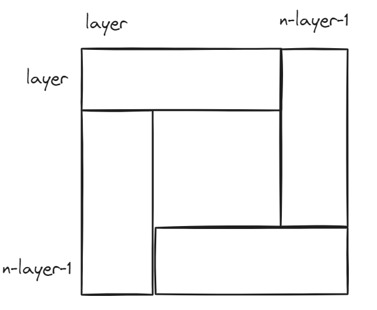

.. _day2

Day2: 数组理论基础-2
====================

LC977-有序数组平方-S:
---------------------

-  给你一个按 **非递减顺序** 排序的整数数组 nums, 返回
   **每个数字的平方** 组成的新数组，要求也按 **非递减顺序** 排序。

-  思路：最大平方数在两端，比较两端–从后往前填入较大值

-  code

   .. code:: c++

        vector<int> sortedSquares(vector<int>& nums) {
            vector<int> res(nums.size(), 0);
            int left = 0, right = nums.size() - 1;
            for (int i = nums.size()-1; i >= 0; i--) {
                if (nums[left] + nums[right] > 0) {
                    res[i] = nums[right]*nums[right];
                    right --;
                } else {
                    res[i] = nums[left]*nums[left];
                    left ++;
                }
            }
            return res;
        }

-  时间复杂度: O(n)

-  空间复杂度: O(1)

LC209-长度最小的子数组-M
------------------------

-  给定一个含有 n 个\ *正整数*\ 的数组和一个\ *正整数*
   target。找出该数组中满足其总和大于等于 target 的长度最小的
   **连续子数组** [numsl, numsl+1, …, numsr-1, numsr]
   ，并\ *返回其长度*\ 。\ *如果不存在符合条件的子数组，返回 0* 。

-  note1: 需要额外检测是否不存在符合条件的子数组

-  note2:
   滑动窗口法能将暴力枚举的\ :math:`O(n^2)`\ 优化为\ :math:`O(n)`\ 的关键: **正整数**\ 数组, sum具有单调性

-  code-滑动窗口

   .. code:: c++

        int minSubArrayLen(int target, vector<int>& nums) {
            int minLen = nums.size();
            int beginer = 0;
            int sum = 0, len = 0;
            bool update_f = false;
            for (int ender = 0; ender < nums.size(); ender++){
                sum += nums[ender];
                while (sum >= target) {
                    update_f = true;
                    len = ender - beginer + 1;
                    minLen = len < minLen ? len : minLen;
                    sum -= nums[beginer];
                    beginer++;
                }
            }
            if (update_f) return minLen; // if数组之和小于target
            else return 0;
        }

-  时间复杂度: O(n) - 每个元素最多被扫描两次

-  空间复杂度: O(1)

LC59-spiral matrix 2 - M
------------------------

-  思路如图

    .. image:: img/image.png
        :width: 50%
        :align: left
    
        每层分四块, 依次填入

-  note1: 只需要n/2个layer就可以填满

-  note2: n为奇数时, 矩阵中间的值要单独处理

-  code

   .. code:: c++

        vector<vector<int>> generateMatrix(int n) {
            int num = 1;
            vector<vector<int> > res(n, vector<int>(n, 0));
            for (int layer = 0; layer < n/2; layer++) {
                for (int i = layer; i < n-layer-1; i++) {
                    res[layer][i] = num++;
                }
                for (int j = layer; j < n-layer-1; j++) {
                    res[j][n-layer-1] = num++;
                }
                for (int i = n-layer-1; i > layer; i--) {
                    res[n-layer-1][i] = num++;
                }
                for (int j = n-layer-1; j > layer; j--) {
                    res[j][layer] = num++;
                }
            }
            if (n % 2) {
                res[n/2][n/2] = num;
            }
            return res;
        }

-  时间复杂度：O(n^2)

-  空间复杂度：O(1)

